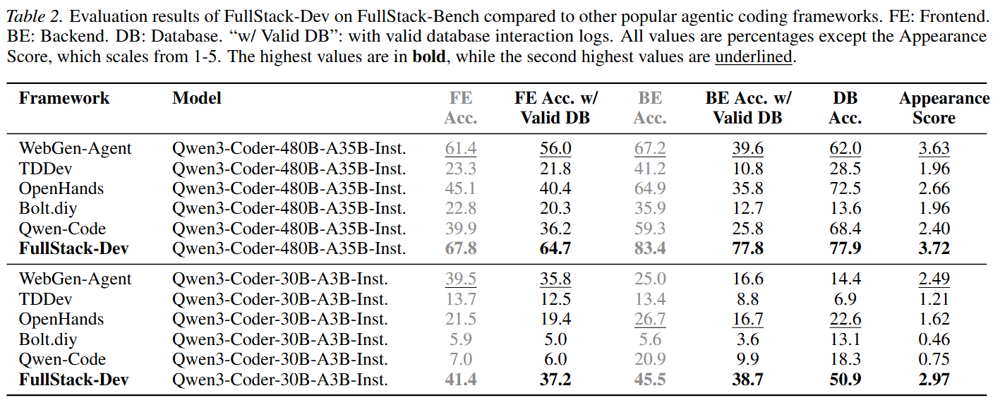

# FullStack-Bench

### Overview

This is a repository for the full-stack evaluation benchmark (FullStack-Bench) described in the paper "FullStack-Agent: Enhancing Agentic Full-Stack Web Coding via Development-Oriented Testing and Repository Back-Translation". It also contains code for the baseline testing.


### Installation

Run the following commands:

```bash
# install python dependencies
git clone https://github.com/mnluzimu/FullStack-Bench.git
cd FullStack-Bench
conda create -p env/fullstack-bench python=3.10 -y
conda activate env/fullstack-bench
pip install -r requirements.txt
```

### Quick Start

For frontend, backend, and database testing of FullStack-Bench, run:

```bash
# FullStack-Dev:
bash src/eval_fullstack-dev/ui_eval_with_answer.sh $WORKING_DIR_ROOT $LOG_DIR_ROOT

# Baselines
# WebGen-Agent:
bash src/eval_fullstack-dev/ui_eval_with_answer.sh $WORKING_DIR_ROOT $LOG_DIR_ROOT
# OpenHands:
bash src/eval_fullstack-dev/ui_eval_with_answer.sh $WORKING_DIR_ROOT $LOG_DIR_ROOT
# Qwen-Code:
python src/eval_qwen-code/ui_eval_with_answer.py --in_dir $WORKING_DIR_ROOT --log_dir $LOG_DIR_ROOT
# TDDev:
python src/eval_tddev/ui_eval_with_answer.py --in_dir $WORKING_DIR_ROOT --log_dir $LOG_DIR_ROOT
# Bolt.diy:
python src/eval_bolt_diy/ui_eval_with_answer.py --in_dir $WORKING_DIR_ROOT --log_dir $LOG_DIR_ROOT
```

### Appearance Evaluation

```bash
bash src/grade_appearance/eval_appearance_parallel.sh $LOG_DIR_ROOT
```

### Experimental Results

Experimental results of FullStack-Dev on [FullStack-Bench](https://github.com/mnluzimu/FullStack-Bench) compared to popular baseline methods are shown below:


